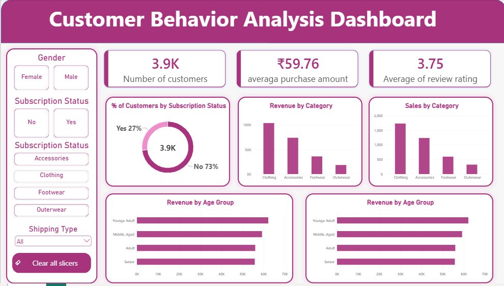

# 🛒 Customer Shopping Behavior Analysis

## 📌 Project Overview
This project analyzes customer shopping behavior using transactional data from 3,900 purchases across various product categories to uncover insights into spending patterns, customer segments, product preferences, and subscription behavior.

## 🛠️ Tech Stack & Tools Used
- **Python (Pandas)**: Data cleaning, missing value imputation, and feature engineering.
- **PostgreSQL**: Advanced SQL querying for business metrics and customer segmentation.
- **Power BI**: Interactive dashboard visualisations.

## 📊 Key Findings & Insights
- **Revenue by Gender**: Male customers generated $157,890 compared to $75,191 from Female customers.
- **Customer Segments**: 3,116 Loyal customers, 701 Returning, and 83 New customers.
- **Top Subscription Split**: 27% Subscribed vs 73% Non-Subscribed.

## 📁 Repository Structure
- `customer_shopping_behavior.csv`: Dataset
- `notebook.ipynb`: Data Cleaning & Feature Engineering Script
- `queries.sql`: PostgreSQL Analysis Queries
- `Customer Shopping Behavior Analysis.pdf`: Detailed Project Report
- - `Customer behavior analysis.pbix`: Detailed Project Report
## 📊 Power BI Dashboard
## 📊 Interactive Power BI Dashboard

### Key Metrics Shown:
- **Total Customers**: 3,900
- **Average Purchase Amount**: ₹59.76
- **Average Review Rating**: 3.75
- **Subscription Split**: 27% Subscribed vs 73% Non-Subscribed
